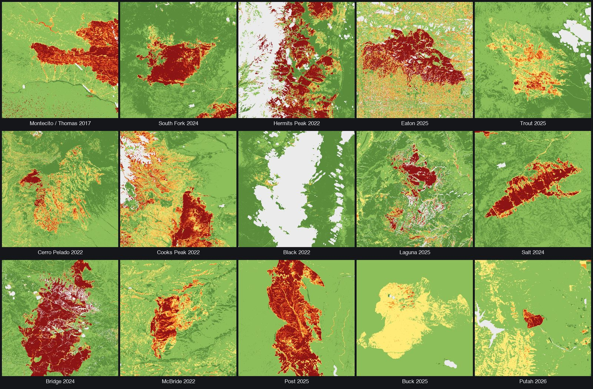
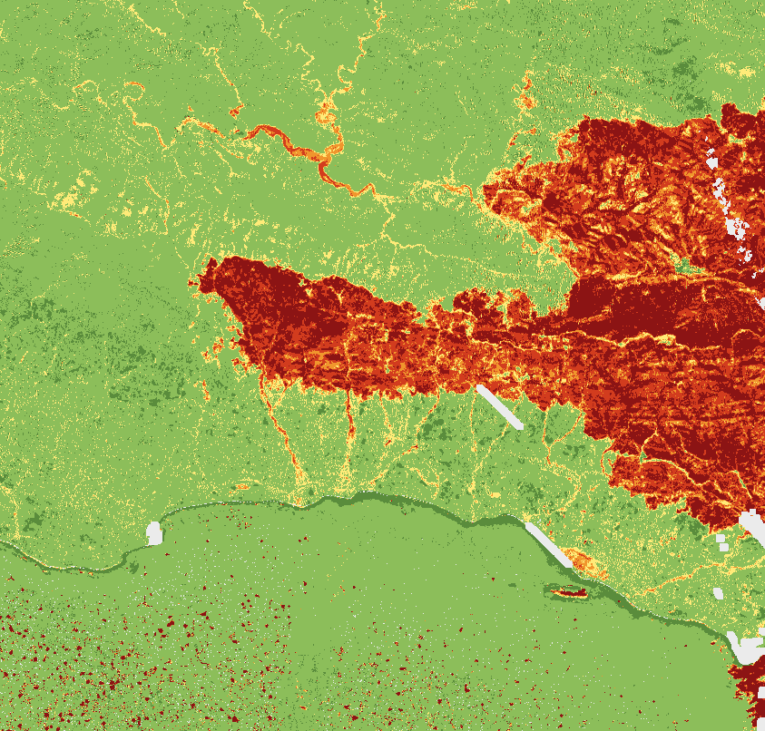
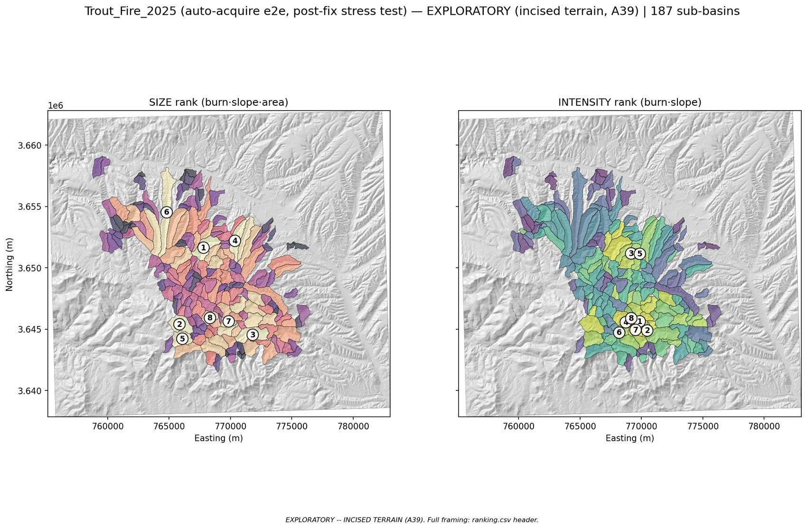

# Post-Fire Debris-Flow Watershed Screening

**Public satellite data in → a defensible "assess these watersheds first" ranking out — for the burned watersheds the official hazard-assessment system never reaches.**


*Fifteen real fires, one pipeline: every burn-severity raster above (dNBR) was computed by this tool from free public imagery during its stress-test campaign — no field data, no paid products, no manual GIS.*

After a wildfire, the burned slopes above a town can turn a routine rainstorm into a debris flow. The U.S. has excellent tools for assessing that hazard — but they run on a **request-and-select basis**: a fire is assessed only if an official requests it and capacity allows. Well-resourced states (CA, WA, CO) field rapid-response teams; fires outside that coverage — smaller, lower-profile, in thinner-coverage regions — can receive **no formal screening at all**. This tool closes that gap: a zero-wait triage screen built entirely on free public data that tells a jurisdiction *which watersheds to look at first*. It was validated by back-testing against the January 2018 Montecito disaster, and it is not a paper exercise: a state emergency-management agency has confirmed they will use it as-is.

It is equally defined by what it refuses to do: it is an **uncalibrated, within-fire ordinal ranker** — not a likelihood model, not a volume model, not an inundation footprint. When its inputs don't support an answer, it says so loudly instead of guessing. That restraint is not a missing feature; it is the design.

## At a glance

| | |
|---|---|
| **Validated** | Back-tested on the 2017 Thomas Fire → 2018 Montecito disaster: within-fire rank-AUC **0.9722**, all **6/6** documented debris-flow basins in the top tercile, top-ranked basin physically confirmed (~19,000 m³ excavated from its catch basin) |
| **Cross-checked** | Burn input swapped from field-validated SBS to self-computed satellite dNBR: **identical rank-AUC (0.9722)**, Spearman ρ = 0.944 · flow field reproduced by an independent second engine (pyflwdir, r = 0.9994) · incised tier concordant with the independent USGS assessment of the 2024 South Fork/Salt fires (ρ = +0.740) |
| **Stress-tested** | **15 historical fires** (2017–2026) run end-to-end through the acquisition path, with Landsat-vs-Sentinel divergence probes comparing both sensors' rankings on identical terrain; the defects the campaign surfaced were fixed and locked with tests |
| **Tested** | **458-test suite** (457 pass, 1 environment-conditional skip): behavior locks that pin the validated ranking byte-for-byte, property-based tests, golden oracles, refusal-path coverage |
| **Two engines, routed by terrain** | `pysheds` canyon-mouth catchments on range-front fires (the validated path) · WhiteboxTools whole-network sub-basins on incised terrain (exploratory, explicitly disclaimed) |
| **Honest by construction** | Refuses rather than fabricates: out-of-coverage, cloud-obscured, or terrain-incompatible inputs produce a legible "cannot assess — here's why," never a confident-looking wrong ranking |
| **Zero data cost** | USGS 3DEP terrain, Sentinel-2/Landsat imagery, OpenStreetMap assets — all free, all public, ~4,300 lines of Python |

## Quick start

```bash
conda env create -f environment.yml && conda activate wildfire-watershed
```

Run a registered validation fire from the CLI (`montecito` — SBS validation, `montecito_dnbr` — the dNBR swap, `southfork` — incised):

```bash
python run.py --fire montecito      # → out/montecito/: ranking.csv + basins.geojson
```

Or screen an arbitrary fire anywhere in the contiguous US from the local app:

```bash
streamlit run app.py
```

Draw a bounding box, then either upload a dNBR GeoTIFF you already have, or give the tool the fire's dates and let it find, score, and — after your explicit approval — build one from public Sentinel-2/Landsat imagery. Either way: a ranked map + CSV, or an honest refusal.

**Coverage:** any bounding box in the contiguous US (UTM 10N–19N). An out-of-CONUS box, or one over the single-fire area cap (1.0 deg²), refuses at the door before any data is fetched.

**Reading paths.** Engineers/reviewers: [Architecture & tech stack](#architecture--tech-stack), [Design decisions](#design-decisions), [Testing & verification](#testing--verification). Domain scientists: [Method](#how-it-works), [Validation](#validation), [Limitations](#limitations), [References](#references). Everyone: the next section.

---

## What it is — and is NOT

This distinction is the spine of the project; every design choice below exists to hold it.

- **Not an inundation or runout predictor.** It never claims "this house will be hit" and never draws confident danger polygons over buildings. Real lives sit downstream of this distinction: a model painting confident danger zones over homes is dangerous, not merely wrong.
- **Not a competitor to or replacement for USGS.** USGS runs field-validated likelihood (M1) and volume (Gartner) models and is actively building downstream-routing tools. This tool does not out-model them and must never be described as approximating them — it deliberately omits the rainfall and soil inputs those models require.
- **Not a flow-physics model.** Runout is genuinely hard and is where funded domain expertise belongs. This tool stops short of it on purpose.
- **Not cross-fire comparable.** Scores are ordinal and hold *within a single fire only*. A rank from Fire A cannot be compared to a rank from Fire B.

Every output is framed as *"watersheds warranting detailed assessment"* — a within-fire relative ranking, never an absolute prediction. That framing is stamped into every artifact the tool writes, so it survives being forwarded out of context.

## Where it fits

A triage screen for the fires the existing system doesn't reach — it complements the programs below and replaces none of them.

| Program | What it provides | Coverage |
|---|---|---|
| **USGS post-fire assessments** | Field-validated likelihood (M1) and volume (Gartner) models; downstream-routing tools in development | Request-and-select; capacity-limited |
| **State rapid-response teams** (CA, WA, CO) | Fast local hazard assessment | Well-resourced western states only |
| **BAER teams** | Field-validated Soil Burn Severity (SBS) | Only fires a BAER team is dispatched to |
| **State geological surveys** (e.g. CGS) | Prioritization stacks: burn, slope, area **plus** regional susceptibility priors and rainfall history | Program-dependent |
| **This tool** | A zero-wait within-fire ranking from public data — "assess these watersheds first" | Any contiguous-US fire; no request required |

A jurisdiction whose fire was never assessed still gets a defensible starting point for *where to look first* — not a hazard determination, but a prioritized list for routing scarce assessment capacity toward a field recon or a formal USGS/state request.

## What it produces

One run over a single fire writes to `out/<fire>/`:

- **`ranking.csv`** — the within-fire ordinal ranking of detected basins, highest screening concern first, with per-basin terms (`mean_burn`, `mean_slope`, `area_km2`), both dNBR arms, and coverage/uncertainty flags. Two leading comment lines carry the screening framing and the burn-source provenance stamp.
- **`basins.geojson`** — the delineated basin polygons (EPSG:4326) with a top-level `provenance` member, so the framing travels with the geometry.
- **`refused_basins.csv`** — basins whose dNBR NoData/cloud fraction exceeds the frozen 20% bar are refused *individually*: "insufficient data — hazard unknown," never silently scored low. The ranking covers clean basins only.

The interactive ranked-basin map renders live in the local app (fill = headline rank; outlines flag basins where the two dNBR arms disagree). There is no confident-hazard raster and no per-building output, by design.

**How to read a ranking:**

- Rank **1** is the highest *screening concern within this fire* — "look here first," not "this will flow."
- It is **not** a probability, a volume, an inundation footprint, or a comparison against any other fire.
- Use it to prioritize which catchments get a closer look — a field recon, or a request for a formal USGS/state assessment — never as a hazard call over specific homes.
- If you cite or forward a ranking, **carry the framing with it.**

**Two terrain tiers, one screening frame.** Range-front fires (a steep range spilling onto a flatter plain) get the validated canyon-mouth ranking. Fires without that shape — incised, dissected highland — get a separate **exploratory, disclaimed** ranking instead of no ranking at all. And a loud failure is still a valid result: missing burn data, a DEM that doesn't cover the drainage network, imagery too cloudy for a dNBR, a collapsing catchment — the tool **produces no ranking and says why**. An honest "cannot assess" is a correct outcome; a confident-looking wrong ranking is the failure mode the whole system is built against.

---

## How it works

Three public data ingredients, one deliberately simple scoring heuristic, no physics simulation. The pipeline is five pure stages — `ingest → hydrology → delineate → score → outputs` — wired in `src/pipeline.py`, with `config.py` holding per-fire scalars and `grids.py` holding the inter-stage data contract.

### Data inputs

| Input | Source | Notes |
|---|---|---|
| **Terrain (DEM)** | USGS 3DEP 1/3 arc-second (~10 m) COG | The National Map staged products on AWS S3, read via `/vsicurl/`; windowed to the bbox and bilinearly reprojected onto a canonical 10 m UTM grid. The Montecito validation runs on a fixed EPSG:32611 grid for reconstruction fidelity. |
| **Burn severity — dNBR** (production default) | Sentinel-2 L2A (primary) · Landsat 8/9 Collection-2 L2 (fallback) | Continuous spectral-change index computed by the tool; available for any fire the satellites see. Sentinel-2 via Earth Search on AWS (Element84 STAC); Landsat via Microsoft Planetary Computer STAC. |
| **Burn severity — BAER SBS** (preferred when it exists) | BAER Soil Burn Severity | Field-validated 4-class soil product; exists only for fires a BAER team assessed. |
| **Downstream assets** | OpenStreetMap building footprints (Overpass) | Defines "downstream of what": catchments draining away from anything to protect are discarded. Reduced to representative centroids in the metric CRS. |

All free; no licensing cost. The network boundary is deliberate: `src/` never touches the network. All fetching lives in `acquire.py` and the `autoacquire/` package, which stage files to disk for the pure pipeline to consume.

### Burn severity from public imagery



For fires without BAER SBS — the tool's actual target population — burn severity comes from the Normalized Burn Ratio difference, computed from surface-reflectance imagery:

```
NBR   = (NIR − SWIR) / (NIR + SWIR)
dNBR  = NBR_pre − NBR_post     # raw scale, positive = burned; never ×1000
```

- **Sentinel-2 L2A** (primary): NIR = **B8A**, SWIR = **B12** (both 20 m). Reflectance = `(DN − 1000) / 10000` (BOA offset, processing baseline ≥ 04.00). Per-pixel cloud/shadow masking from the Scene Classification Layer.
- **Landsat 8/9 Collection-2 L2** (fallback): NIR = **B5**, SWIR2 = **B7** (both 30 m). Reflectance = `DN × 0.0000275 − 0.2`. Masking from QA_PIXEL fill + cloud bits.

*(Right: the 2017 Thomas Fire's dNBR as computed by this tool — the burn scar that set up the Montecito disaster, red against unburned green above the coastline.)*

The continuous dNBR is binned to four severity classes at the interior break edges `(0.100, 0.270, 0.440, 0.660)` (raw scale). **Honest provenance:** the NBR/dNBR index math and sensor scalings are settled, primary-source-verified science (Key & Benson 2006; ESA/USGS documentation). The break table is the conventional USGS/UN-SPIDER first-approximation table — real and widely used, but its citation chain does not terminate as cleanly as a footnote implies, and fixed absolute thresholds carry a published bias in sparsely-vegetated terrain (Miller & Thode 2007). The tool adopts the generic table literally and un-tuned as a deliberate anti-fitting firewall, and treats the classes as a *first approximation* — tolerable for an ordinal triage ranker, intolerable for a prediction.

The dNBR path runs **two arms**: Arm A (nearest-neighbor resampling, binned to 4 classes) is the pre-registered headline; Arm B (bilinear, continuous transfer) rides alongside as a cross-check. `rank_delta = |rankA − rankB|` flags basins where the arms disagree — treat those ranks as uncertain.

### The pipeline

**Ingest.** Loads the DEM, one burn raster, and the asset layer. The burn source is selected here, once, by precedence — SBS if it covers the whole analysis area, else dNBR — **never blended** — and stamped onto a single provenance object every downstream stage reads. Missing or partial burn coverage fails loud here. `mean_burn` is coverage-weighted: cells outside the perimeter or NoData count as zero severity, so a partially-burned basin is never flattered by averaging only its burned cells.

**Hydrology.** `pysheds` flow modeling on the conditioned DEM: fill pits → fill depressions → resolve flats → D8 flow direction → flow accumulation. Pure terrain processing — no outlets, no scores. (An independent `pyflwdir` engine reproduces this flow field to a Pearson correlation of 0.9994 on the scored basins — a confidence check, not a runtime dependency.)

**Delineation.** Channel cells are those above the flow-accumulation threshold (500 cells ≈ 0.05 km²). Outlets are channel cells crossing the mountain-front contour (default 150 m) going downhill — where creeks leave the mountains onto developed fans. Each outlet's upslope catchment is delineated **in index mode (`row, col`)**, catchments under 0.1 km² are discarded, and only those draining within 600 m of an asset are kept. Larger catchments claim contested cells first, so no cell is counted twice.

**Scoring.** Each retained basin gets the frozen, pre-registered heuristic:

```
score(basin) = mean_burn_severity × mean_slope × contributing_area_km²
```

Slope is the dimensionless gradient magnitude `tan θ` (rise/run, central differences on the raw metric DEM); `mean_burn` ∈ [0, 1]; area in km². Each term proxies a first-order driver: burn → runoff generation and infiltration collapse; slope → transport energy; area → water and sediment volume available. The formula is not a tunable — changing it re-opens validation. Basins are ranked ordinally within the fire.

**Output.** Writes `ranking.csv`, `basins.geojson`, and `refused_basins.csv`, each stamped with burn-source provenance and the embedded screening framing.

### Two terrain tiers

Everything above is the **range-front** path: canyon-mouth outlets, index-mode catchments, the frozen formula — the validated method. A router (`assess_hypsometric_applicability`, run first on the raw DEM) measures the low-elevation hypsometric span `p10 − p1`; a span > 50 m means there is no plain→range break to anchor a canyon-mouth outlet to.

Such fires — incised, dissected highland — route to a separate, **exploratory and disclaimed** tier instead of refusing outright:

- **WhiteboxTools** delineates the whole drainage network into sub-basins split at channel confluences (no canyon-mouth needed), using breach-carve conditioning (`BreachDepressionsLeastCost`) that preserves incised channels the production fill-only chain would smear, then `D8Pointer → D8FlowAccumulation → ExtractStreams → Subbasins`.
- The drains-to-asset filter is **dropped** — there is no depositional plain for a building to sit near, and a wilderness fire would otherwise silently recreate a refusal.
- Basins carry the **same frozen headline ranking as range-front fires** (`score`), plus a disclosed **`intensity`** companion column (`mean_burn × mean_slope`, area-independent) — flagged because contributing area's meaning on a segmentation-threshold sub-basin depends on the segmentation itself, and on the one ground-truth case the intensity ordering actually scored higher (AUC 0.887 vs 0.790). One headline across both terrain classes; the caveat is disclosed, never papered over.

Every incised artifact carries an explicit disclaimer — **unvalidated on this terrain class**, read as relative *source* susceptibility for triage only (not runout, not deposition, not which fan is threatened). An incised fire supplying SBS instead of dNBR still fails loud (v1 scope), as does one supplying documented-flow "truth" creeks.

Two tiers, two engines: `pysheds` canyon-mouth catchments where the terrain physically anchors them, WhiteboxTools whole-network sub-basins where it doesn't — and the range-front path stays frozen and byte-identical.

### Auto-acquiring a dNBR


*Dates in, ranking out: the 2025 Trout Fire run end-to-end through the auto-acquire path — scene search → human-approved pair → dNBR → 187 ranked sub-basins on the exploratory incised tier, exported both ways (area-weighted `score` vs `intensity`) with the disclaimer stamped into the artifact.*

The **Generate from dates** app mode (and the `autoacquire/` CLI) turns coordinates + fire dates into a real dNBR without the user touching a satellite catalog. The design principle: **deterministic code proposes, a human disposes** — there is no LLM anywhere in the science path.

- **Scene search.** Sentinel-2 L2A primary; Landsat 8/9 as a pair-level fallback. Sensors never mix within a pair. Same-sensor same-day adjacent tiles merge into one candidate; the selector filters at search time to what the creator can actually build (baseline eligibility, zone checks) so a human never approves a pair that later aborts.
- **Timing windows.** Pre-fire scene within 90 days before ignition; post-fire scene at or after containment, bounded by a green-up ceiling (default +90 days, operator-extendable to +180) so regrowth doesn't wash out the burn signal. If no clean post-fire scene exists yet, the tool reports a **waiting** state rather than fabricating one.
- **Cloud gating.** A coarse metadata pre-filter drops tiles over 80% cloud (never decisive). The decisive gate is per-pixel: combined pre∩post valid fraction over the drawn box must be ≥ 0.50, derived from the pipeline's frozen 20% per-basin NoData guard. A rubric bins each pair Good / OK / Marginal on cloud-over-fire.
- **Human approval is a separate, mandatory gate.** `select()` proposes and scores; it builds nothing. Nothing becomes a dNBR until a person approves the pair on a scorecard — per-scene cloud over the fire, true-color previews, a verdict, and swap-in alternatives.
- **Bounded sweep on refusal.** If a built pair still trips the per-basin cloud refusal, the tool automatically retries the vetted alternate scenes, then the other sensor, under the one existing approval — writing the full attempt trail to `sweep_attempts.json`.

The failure mode of the whole tool concentrates here, in scene selection — which is exactly why acquisition is deterministic, auditable, and human-gated rather than automated end-to-end.

### Parameters

All per-fire tunables live in one auditable place (`src/config.py`), keyed per fire so editing one fire's values can never silently break another's validated result.

| Parameter | Value | Meaning |
|---|---|---|
| `CONTOUR_M` | 150 m | Mountain-front contour for canyon-mouth outlet detection (per-fire; operator-set in the app) |
| `ACC_THRESHOLD_CELLS` | 500 | Min flow accumulation for a channel cell (~0.05 km²) |
| `MIN_BASIN_KM2` | 0.1 | Discard catchments smaller than this |
| `DRAINS_TO_ASSET_M` | 600 m | Keep only catchments draining within this distance of an asset (range-front only) |
| `TRUTH_MATCH_M` | 250 m | Tolerance for matching a basin to a documented flow (validation) |
| `HYPSOMETRIC_SPAN_THRESHOLD_M` | 50 m | Low-elevation span above which a fire routes to the incised tier |
| burn weights (SBS) | `{1: 0.0, 2: 0.33, 3: 0.67, 4: 1.0}` | Soil-burn-severity class → normalized severity |
| `DNBR_BIN_EDGES` | `(0.100, 0.270, 0.440, 0.660)` | Interior break edges, raw dNBR → 4 severity classes (Arm A) |
| `DNBR_NODATA_FAILLOUD_FRAC` | 0.20 | Per-basin NoData fraction beyond which that basin is refused |
| `MASTER_MIN_AOI_FRACTION` | 0.05 | Master-outlet catchment must exceed this fraction of the valid AOI (anti-0 km² guard) |
| `ALLOWED_UTM_ZONES` | EPSG 32610–32619 | Accepted ingest zones (CONUS, UTM 10N–19N) |

SBS class encoding: `1` unburned/very-low · `2` low · `3` moderate · `4` high · `0` masked/developed · `15` no-data.

**Incised-tier constants** (frozen, `SUBBASIN_*`): accumulation threshold 3000 cells (~0.30 km², ~6× the production channel threshold, splitting at trunk confluences); burn-fraction floor 0.25; slope floor `tan θ ≥ 0.05` (~2.9°); breach search radius 100 cells (1 km at 10 m). Carried over from the sandbox that developed the tier and **not** set result-blind (the slope floor was added after seeing output); they are frozen and documented as such rather than described as pre-registered.

---

## Validation

The claim structure matters as much as the numbers: each result below states what it establishes *and what it doesn't*.

**Montecito back-test (the anchor).** The ranking method is back-tested against the **2017 Thomas Fire / 2018 Montecito** event — one of the best-documented post-fire debris-flow disasters on record — with BAER SBS as the burn input on a fixed EPSG:32611 grid:

- **All six documented-flow basins landed in the top tercile** of the ranking.
- **The top-ranked basin, Cold Spring, flowed** — confirmed physically by ~19,000 m³ of debris excavated from its catch basin.
- **Within-fire rank-AUC = 0.9722** across 36 candidate basins; a ~25× score separation between flowed and non-flowed basins.

The case is locked by the test suite — ranking order, AUC, basin count, and a 44.7273 km² master-outlet sanity area are all asserted, so any regression trips a test. (Older documents cite `0.987 / 39.19 km² / 32 basins`: those figures came from the original analysis extent, which is no longer recoverable, and are not bit-reproducible. The reconstructed oracle the code actually locks is `0.9722 / 44.7273 km² / 36 basins`. The code and the lock are authoritative.)

**dNBR input-swap (the honest headline).** Swapping the burn input from field-validated SBS to a self-computed dNBR on the same Montecito AOI — same DEM, hydrology, delineation, and frozen formula; only `mean_burn` changes — the dNBR ranking reproduces the SBS result on the metric that maps to the tool's job: **rank-AUC = 0.9722 under SBS, dNBR Arm A, and dNBR Arm B — identical**; all 6/6 flowed basins top-tercile; Spearman ρ(SBS, dNBR-A) = 0.944. **But the pre-registered binary "Cold Spring is exactly #1" criterion failed** — Arm A ranks San Ysidro Creek #1 and Cold Spring #2 on a 1.03% score margin (Arm B recovers Cold Spring #1). The dNBR path is therefore framed as **triage-validated, not exact-rank-validated (n = 1)**: it finds the flow basins as well as SBS does, but exact top-of-list order is not established on one fire. (This validation dNBR was Landsat-8 30 m; a 30 m burn signal on a 10 m grid is itself a stated caveat.)

**Generalization.** Run end-to-end on the **2026 Putah Fire** (Yolo County, CA) — a small contained fire with no existing hazard assessment. From a Sentinel-2 dNBR it passed the terrain-applicability check and ranked six canyon-mouth basins, both dNBR arms agreeing. A demonstration the pipeline generalizes to new terrain, not a truth test (no ground truth exists; that is the point of the tool).

**Incised tier — two pieces of evidence, different kinds, both bounded.**
1. Re-running the *range-front* Montecito case under the incised engine's segmentation, the ordering keeps its skill — AUC(intensity) = 0.887 over 88 sub-basins (the frozen score: 0.790 on the same case), 10/10 of the top-10 intensity-ranked basins flowed. This shows the method discriminates where truth exists — but on a range-front fire (effective n = 6 flow events), **not** the incised terrain class the tier serves. (The frozen `score` remains the headline on incised fires for cross-terrain consistency; `intensity`'s higher AUC on this one case is disclosed in the artifact rather than promoted on n = 1.)
2. On an actual incised fire — the **2024 South Fork / Salt fires** (Ruidoso, NM) — a **pre-registered** concordance check against the independent USGS `sfk2024` assessment: **Spearman ρ = +0.740** (length-weighted combined-hazard class at 24 mm/h, 93 of 99 sub-basins, band ≥ 0.5 concordant). The first real incised-terrain signal — and it is **concordance, not equivalence**: the two share burn and slope as drivers, USGS additionally uses rainfall and soils, and it is one fire against a coarse near-binary hazard ordinal. Consistency with an independent assessment, not predictive skill.

**Stress campaign.** The acquisition path was stress-run against a frozen registry of **15 historical fires** (2017 Thomas → 2026 Putah, spanning CA and NM terrain, Sentinel-2 and Landsat eras — the montage at the top of this page). The campaign measured end-to-end behavior — scene search, gating, dNBR build, ranking — and sensor-divergence probes forced fires through the production selector twice (Sentinel-2 arm vs Landsat arm, same staged terrain) to compare the resulting rankings. It surfaced real defects at the selection seam — approve-then-abort paths where a human could bless a pair the builder would then refuse — which were fixed as a principle (*the machine never proposes what it cannot build*) and locked with hermetic tests. Fires that previously succeeded remained byte-identical after the fix.

## Testing & verification

- **458 tests** (457 pass, 1 environment-conditional skip; ~74 s): behavior locks, property-based tests (Hypothesis), golden oracles, refusal-path coverage, hermetic acquisition tests.
- **The behavior lock pins the validated result byte-for-byte** — ranking order, AUC 0.9722, basin count, master-outlet area. A refactor that shifts any of it fails CI-style, immediately.
- **Oracles are read-only.** `validation/gate.py`, the frozen reports in `validation/reports/`, and the behavior lock are never edited to make a run pass: if a run doesn't match, the run is wrong.
- **Independent cross-checks**, not self-agreement: a second flow engine (pyflwdir, r = 0.9994), a second sensor (Landsat vs Sentinel-2 divergence probes), a second burn input (SBS vs dNBR swap), and an independent agency's assessment (USGS sfk2024 concordance).
- **Known-answer assertions at runtime**: the master-outlet catchment must exceed a floor fraction of the analysis area, or the run aborts — the guard that caught the silent-0 km² catchment bug (see [Design decisions](#design-decisions)).

## Limitations

The tool is a screening aid, and its rankings are meant to be read with these boundaries in mind.

- **Rankings are relative and within-fire.** Not a probability, not a volume, not a comparison between fires.
- **Fixed dNBR breaks are region-dependent.** Published per-fire calibrated thresholds vary widely, and absolute-dNBR thresholding carries a documented bias in sparsely-vegetated terrain (chaparral, shrubland, arid sites — precisely Montecito's terrain, and precisely where the bias is worst). The tool adopts a generic table literally and un-tuned; the classes are a first approximation. The best CBI-validated dNBR datasets are confined to western-US conifer forests, so even the accuracy ceiling (~50% of variance explained, ~60% overall accuracy) is an out-of-domain extrapolation here — within what an ordinal triage ranker tolerates, outside what a prediction could.
- **The `× area` term is linear and uncapped.** A large, moderately-burned catchment can outrank a small, severely-burned one. For context, the USGS M1 likelihood model is calibrated on basins of 0.2–8 km² (Staley et al. 2016); this tool applies no upper bound and so leans toward larger basins at the high end. A documented future experiment (area-dampening), not a live knob.
- **No rainfall or regional susceptibility.** The screen weighs burn, slope, and area — not storm intensity, and not the susceptibility that geology, soils, and sediment supply confer (the San Gabriels reliably produce debris flows; other ranges far less so). Both strongly influence whether a basin actually flows, so a ranking complements — never replaces — an assessment that accounts for them. This is the single most concrete gap surfaced in practitioner outreach.
- **Coverage-weighted `mean_burn` can under-rank a genuinely-hot but low-coverage basin** (the deliberate direction of that trade), and `score = 0.0` is disambiguated from "not assessed" by a `low_coverage` flag rather than silently trusted.

## Design decisions

The load-bearing choices, and why:

**Why a deliberately simple `burn × slope × area` heuristic.** The target is screening triage, not runout simulation. Each term is a first-order driver of debris-flow concern: fuel for the flow (burn), energy to move it (slope), catchment feeding it (area). The formula was pre-registered, validated as written, and frozen — re-tuning after seeing results would forfeit the validation. A finished, honest ranker beats a half-built physics model.

**Why screening, never prediction.** A tool whose outputs may reach a county emergency manager with no surrounding context must never be mistakable for a forecast. The known failure mode of this tool class is a confident-looking wrong answer over someone's home. The system refuses to produce one — relative ranking only, framing embedded in every artifact.

**Why dNBR is the production default even though SBS is higher-quality.** BAER SBS is field-validated and closer to the hydrologic cause — but it only exists for fires a BAER team already assessed, i.e. exactly the fires this tool is *not* for. The target population is un-assessed fires, which by definition lack SBS. dNBR — continuous, computable anywhere Sentinel-2/Landsat see — is what makes the tool usable on its actual targets. SBS is preferred whenever it happens to exist.

**Why burn sources are never blended.** dNBR and SBS sit on different scales measuring subtly different quantities (reflectance change vs field-corrected soil response). Averaging them yields a number that means neither; spatially stitching them reintroduces the same problem across one grid. Exactly one source per run, selected by precedence.

**Why the burn source is decided once and read everywhere.** `burn_source` appears in the CSV, the GeoJSON, the map, the app, and the docs. Several places asserting one fact will eventually drift. It is determined a single time at ingest, stamped onto one frozen provenance object, and only ever read downstream — one source of truth cannot disagree with itself.

**Why fail loud, and why a refusal is a feature.** Real inputs from messy, un-assessed fires violate the clean validation-case template — zero detected outlets, missing burn coverage, odd DEM tiles, imagery too cloudy for a dNBR. On such inputs the tool errors explicitly rather than degrading into a plausible-but-unfounded output. Terrain shape alone no longer refuses (incised fires route to the exploratory tier), but that tier still fails loud where it genuinely can't proceed. A confident-looking wrong ranking is the worst output this project can produce — strictly worse than a loud error.

**Why there is no orchestration layer.** Stages connect through a shared data contract (`grids.py`) enforced by assertions, not through a coordinator object. More files do not equal more correctness; the catchment bug below was killed by an unambiguous contract, not by indirection. Stage order is wired only in the thin `run.py` / `src/pipeline.py` seam.

**Why a local app despite "no backend."** The eventual users — a local emergency manager, a small agency without a GIS team — are not developers. A draw-a-box-plus-upload UI is what makes the validated pipeline reachable by them. The Streamlit app is a deliberate, scoped exception: a **local, single-user tool over finished artifacts**, not a hosted or multi-user service.

**Why outlets are `(row, col)` index tuples, not `(lon, lat)`.** In the validation build, `pysheds` `catchment()` in coordinate mode *silently returned 0 km²* for valid outlets — deleting the two largest flowed basins before it was caught. Index mode is mandatory, the rule is pinned in the data contract, and delineated areas are checked against a known-area master outlet (the tool aborts if the master catchment collapses below a floor fraction of the analysis area). This is the single bug the architecture is most shaped to prevent — and the origin of the project's known-answer-test discipline.

## Architecture & tech stack

Deliberately spare: five pipeline stages, a per-fire config and a data contract, a thin production driver, a coordinate-acquisition layer, an auto-acquire package, and a local app. No orchestration layer, no service tier, no live data.

```
Wildfire-Watershed/
├── README.md                  # this file — what & why, how to read outputs, method
├── environment.yml            # pinned conda environment (environment.lock.yml = exact solve)
│
├── run.py                     # production driver: python run.py --fire <name>
├── acquire.py                 # coordinate acquisition (the network boundary): bbox → staged DEM + assets
├── app.py                     # local Streamlit frontend: bbox + dNBR (upload or generate) → ranked map + CSV, or refusal
│
├── src/                       # the pipeline (pure Python, no network)
│   ├── config.py              # per-fire scalar tunables (contour, thresholds, burn weights, dNBR + subbasin constants)
│   ├── grids.py               # inter-stage data contract: CRS, affine, (row,col) rule, assertions
│   ├── ingest.py              # load inputs; SELECT the one burn source; stamp Provenance
│   ├── hydrology.py           # pysheds: fill → flats → D8 → accumulation
│   ├── delineate.py           # canyon-mouth outlet detection + index-mode catchments; the terrain-span router
│   ├── score.py               # frozen burn×slope×area heuristic + within-fire rank; incised intensity rank
│   ├── subbasins.py           # incised terrain: WhiteboxTools breach-carve + whole-network sub-basins
│   ├── outputs.py             # ranking.csv, basins.geojson, refused_basins.csv + embedded framing
│   └── pipeline.py            # run_pipeline: wires the stages + the two-tier terrain router
│
├── autoacquire/               # coords + fire dates → a real dNBR (deterministic; no LLM in the science path)
│   ├── scene_select.py        # STAC search (S2 primary, Landsat fallback) + eligibility + cloud gate + rubric
│   ├── sweep.py               # bounded retry sweep on per-basin refusal (alternates, then other sensor)
│   ├── dnbr_create.py         # band math → raw dNBR GeoTIFF + quicklook + provenance
│   └── autoacquire_run.py     # select → human approval → create → the frozen ingest → rank
│
├── out/                       # generated, namespaced PER FIRE (never flat)
│   └── <fire>/                #   ranking.csv · basins.geojson · refused_basins.csv
│
├── validation/                # oracles + the drivers that produced them (see validation/README.md)
│   ├── gate.py                # the reconstructed validation oracle (AUC 0.9722 / 36 basins / 44.7273 km²)
│   ├── reports/               # frozen write-ups — read-only anchors, never edited to make a run pass
│   ├── p2_*.py  p3_*.py       # phase drivers, grouped by prefix
│   ├── stress_*.py            # the 15-fire stress campaign: registry, runner, sensor-divergence probes
│   ├── cf11_pyflwdir_crosscheck.py     # independent flow-engine cross-check
│   └── a39_southfork_concordance.py    # incised concordance vs USGS sfk2024
│
├── tests/                     # 458 tests: behavior locks, property tests, refusal paths
│   ├── core/                  # pipeline invariants: the behavior lock, CRS, scoring properties, guards
│   ├── terrain/               # the two-tier router: detection, incised ranking, sub-basins
│   ├── acquire/               # the network seam: scene select, dNBR creation, both arms, sweep, frozen constants
│   ├── app/                   # Streamlit helpers + the entrypoint
│   └── stress/                # locks for the stress-campaign drivers (geometry joins, divergence)
│
└── docs/
    ├── ALGORITHMS.md          # the deep, maintained algorithm reference (start here for method detail)
    ├── ALGORITHMS_REVIEW.md   # design-review notes (2026-07-06; predates the incised + auto-acquire builds)
    └── images/                # README figures
```

Pure-Python pipeline, installed via conda (the reliable path for the GDAL/GEOS/PROJ-backed geospatial stack):

`pysheds` (range-front flow modeling) · `whitebox`/WhiteboxTools (incised sub-basins) · `rasterio` (rasters) · `geopandas` + `pyogrio` (vectors) · `shapely` + `pyproj` (geometry/CRS) · `numpy` · `scipy` · `osmnx` (OSM assets via Overpass) · `folium` + `streamlit` + `streamlit-folium` (local app + maps) · `pyflwdir` (flow cross-check, validation only) · `pytest` + `hypothesis` (behavior + property locks)

A few deliberate choices:

- **conda / conda-forge over pip** — the C-extension geospatial stack installs cleanly from conda-forge and painfully via pip wheels. Version-pinned in `environment.yml`, exact solve captured in `environment.lock.yml`, so the *validated* result stays reproducible. (WhiteboxTools is the one pip dependency; its engine binary is provisioned at install time so `src/` stays network-free at runtime.)
- **`pyogrio` over `fiona`** — vectorized I/O for the GeoPandas read/write path.
- **`numpy < 2`** — pysheds 0.5 calls the removed `np.in1d`.
- **A clean network seam** — `src/` never touches the network; all fetching lives in `acquire.py` and `autoacquire/`, which stage files to disk for the pure pipeline. The app is a thin UI over that seam.

Python 3.11. Exact pins in `environment.yml`.

## Data sources

| Source | Purpose | Access |
|---|---|---|
| USGS 3DEP DEM (1/3 arc-second, ~10 m) | Terrain; all hydrology and the runtime affine derive from here | The National Map staged COGs on AWS S3, via `/vsicurl/` |
| Sentinel-2 L2A (B8A, B12) | Burn severity — production default (primary) | Earth Search on AWS (Element84 STAC) |
| Landsat 8/9 Collection-2 L2 (B5, B7) | Burn severity — dNBR fallback | Microsoft Planetary Computer STAC (SAS-signed) |
| BAER Soil Burn Severity | Burn severity — preferred when available | Field-validated 4-class; only where a BAER team assessed |
| OpenStreetMap buildings (Overpass) | Downstream assets — defines "downstream of what" | © OpenStreetMap contributors |

All free. No licensing cost.

## References

The papers and documents the method, framing, and validation lean on:

**Ground truth & independent assessments**

- Kean, J.W., et al. (2019). Inundation, flow dynamics, and damage in the 9 January 2018 Montecito debris-flow event, California, USA. *Geosphere*, 15(4), 1140–1163. [doi:10.1130/GES02048.1](https://doi.org/10.1130/GES02048.1) — *which Montecito watersheds flowed; the validation case's ground truth.*
- USGS Emergency Assessment of Post-Fire Debris-Flow Hazards, *2024 South Fork and Salt Fires* (`sfk2024`) — *the independent assessment the incised tier's pre-registered concordance check runs against.*

**The operational hazard models this tool deliberately is not**

- Staley, D.M., et al. (2016). *Updated Logistic Regression Equations for the Calculation of Post-Fire Debris-Flow Likelihood in the Western United States.* USGS Open-File Report 2016-1106. [pubs.usgs.gov](https://pubs.usgs.gov/of/2016/1106/ofr20161106.pdf) — *the M1 likelihood model; also the source of the 0.2–8 km² basin-calibration context cited in Limitations.*
- Staley, D.M., Negri, J.A., Kean, J.W., Laber, J.L., Tillery, A.C., & Youberg, A.M. (2017). Prediction of spatially explicit rainfall intensity–duration thresholds for post-fire debris-flow generation in the western United States. *Geomorphology*, 278, 149–162. [doi:10.1016/j.geomorph.2016.10.019](https://doi.org/10.1016/j.geomorph.2016.10.019) — *the M1 formulation used in the USGS sfk2024 assessment.*
- Gartner, J.E., Cannon, S.H., & Santi, P.M. (2014). Empirical models for predicting volumes of sediment deposited by debris flows and sediment-laden floods in the transverse ranges of southern California. *Engineering Geology*, 176, 45–56. [doi:10.1016/j.enggeo.2014.04.008](https://doi.org/10.1016/j.enggeo.2014.04.008) — *the operational volume model.*
- Cannon, S.H., Gartner, J.E., Rupert, M.G., Michael, J.A., Rea, A.H., & Parrett, C. (2010). Predicting the probability and volume of postwildfire debris flows in the intermountain western United States. *Geological Society of America Bulletin*, 122(1–2), 127–144. — *the combined-hazard classification scheme used in USGS assessment products.*
- Kean, J.W., & Staley, D.M. (2021). Forecasting the frequency and magnitude of postwildfire debris flows across southern California. *Earth's Future*. — *process synthesis: initiation → magnitude → frequency → climate.*
- Barnhart, K.R., Romero, V.Y., & Clifford, K.C. (2023). *User Needs Assessment for Postfire Debris-Flow Inundation Hazard Products.* USGS Open-File Report 2023-1025. [pubs.usgs.gov](https://pubs.usgs.gov/publication/ofr20231025/full) — *establishes that no operational runout/inundation product exists — the exact boundary this tool stops at.*

**Burn-severity remote sensing**

- Key, C.H., & Benson, N.C. (2006). Landscape Assessment (LA): Sampling and Analysis Methods. In *FIREMON: Fire Effects Monitoring and Inventory System* (USDA Forest Service RMRS-GTR-164-CD, pp. LA-1–LA-55). — *the NBR/dNBR definition and severity framework; deliberately publishes no fixed universal break table.*
- USGS / UN-SPIDER. *Recommended Practice: Burn Severity Mapping.* — *the generic first-approximation dNBR break table this tool adopts literally and un-tuned, as an anti-fitting firewall.*
- Miller, J.D., & Thode, A.E. (2007). Quantifying burn severity in a heterogeneous landscape with a relative version of the delta Normalized Burn Ratio (dNBR). *Remote Sensing of Environment*, 109, 66–80. — *the published bias of fixed absolute-dNBR thresholds; the case for relativized indices (RdNBR).*

## Further reading

- **[`docs/ALGORITHMS.md`](docs/ALGORITHMS.md)** — the maintained, code-reconciled algorithm reference: hydrology, slope, delineation, the dNBR arms, the frozen score, terrain routing, the parameter table.
- **[`validation/`](validation/)** — the SBS validation report, the dNBR input-swap finding, the reconstructed oracle (`gate.py`), the stress-campaign drivers, and the incised concordance script.

## License

Released under the [MIT License](LICENSE).
